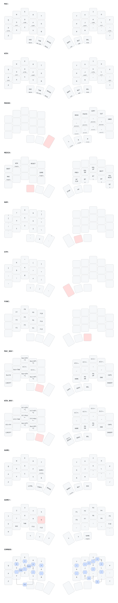

# Temper ZMK Config

My 36-key [Temper](https://github.com/raeedcho/temper) layout, inspired by
[Miryoku](https://github.com/manna-harbour/miryoku) and
[urob's ZMK config](https://github.com/urob/zmk-config).

- macOS is the default profile; a Windows profile is included in the same firmware.
- Hold the `Esc/Media` thumb and tap `A` for macOS or `W` for Windows.
- Hold `Esc/Media` and tap `G` to toggle the FPS-oriented gaming profile.
- The profile switch changes home-row modifiers, editing shortcuts, and navigation shortcuts together. It lasts until reboot; the keyboard starts in macOS mode.
- Hold `Esc/Media` and tap `Q` for the bootloader or `R` to reboot.
- Both profiles share the mouse, media, number, symbol, function, and gaming layers; only base and navigation are OS-specific.
- Bilateral timeless home-row mods retain the 280/175/150 ms behavior.

## Gaming layers

`GAME` shifts the typing layout one physical column to the right, placing
`W/A/S/D` on the more comfortable physical `E/S/D/F` positions. The physical
`Q/A/Z` column becomes `Tab`, `Shift`, and `Ctrl`; the left thumbs provide `F`,
one-shot `GAME+`, and `Space`, while the inner right thumb provides `Alt`. All
movement and action keys are plain keys without hold-tap delays, and the
physical `G` position remains a normal `G`.

`GAME+` forms a normal `1`-through-`0` number row across both halves. The
left home row prioritizes console, classic view/automap zoom, quicksave (`F6`),
and quickload (`F9`); the remaining function keys occupy the bottom row. Its
arrows use the same middle-right positions as the navigation layers. Press the
`GAME+` thumb, then the rightmost `Esc` thumb, to leave gaming mode and return
to whichever macOS or Windows profile was active.

Four-key safety chords: `Q+P+Z+?` powers off; `T+Y+B+N` enters the bootloader.

